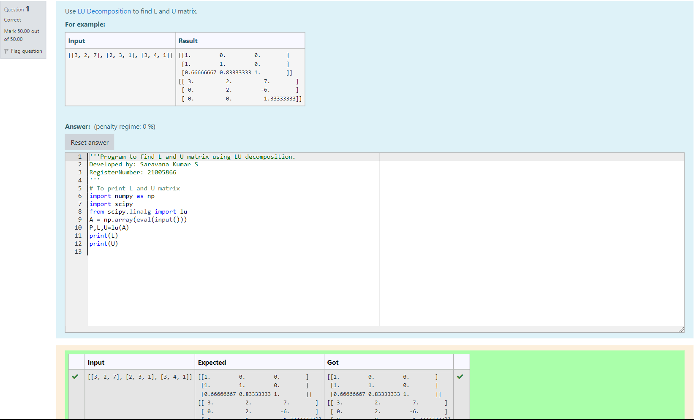
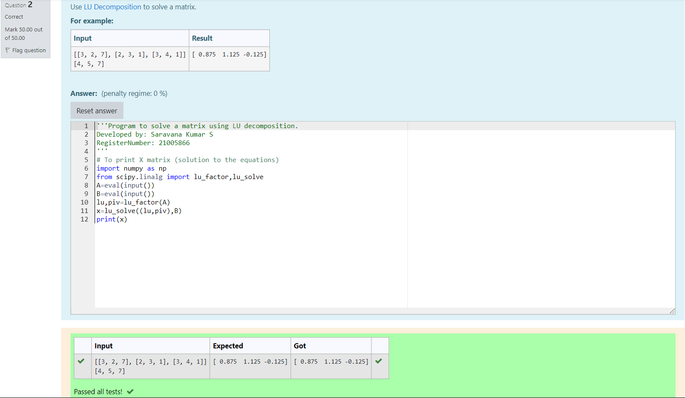

# LU Decomposition 

## AIM:
To write a program to find the LU Decomposition of a matrix.

## Equipments Required:
1. Hardware – PCs
2. Anaconda – Python 3.7 Installation / Moodle-Code Runner

## Algorithm
1. Firstly, import numpy module as 'np' for calculation.
2. Then import scientific  python module.
3. Receive the input from the user and assign the values to the variable.
4. Finally, print L and U.

## Program:
(i) To find the L and U matrix
```
/*
Program to find the L and U matrix.
Developed by: Saravana Kumar S
RegisterNumber: 21005866
*/

import numpy as np
import scipy
from scipy.linalg import lu
A = np.array(eval(input()))
P,L,U=lu(A)
print(L)
print(U)
```
(ii) To find the LU Decomposition of a matrix
```
/*
Program to find the LU Decomposition of a matrix.
Developed by: Saravana Kumar
RegisterNumber: 21005866
*/

import numpy as np
from scipy.linalg import lu_factor,lu_solve
A=eval(input())
B=eval(input())
lu,piv=lu_factor(A)
x=lu_solve((lu,piv),B)
print(x)
```

## Output:
### To find  L and U:

### To find LU decomposition:



## Result:
Thus the program to find the LU Decomposition of a matrix is written and verified using python programming.

